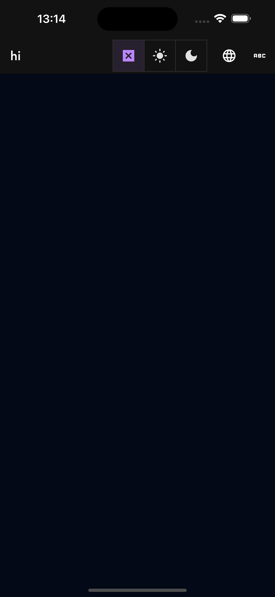
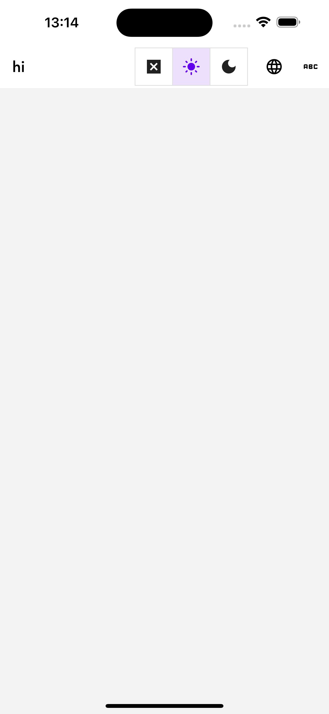
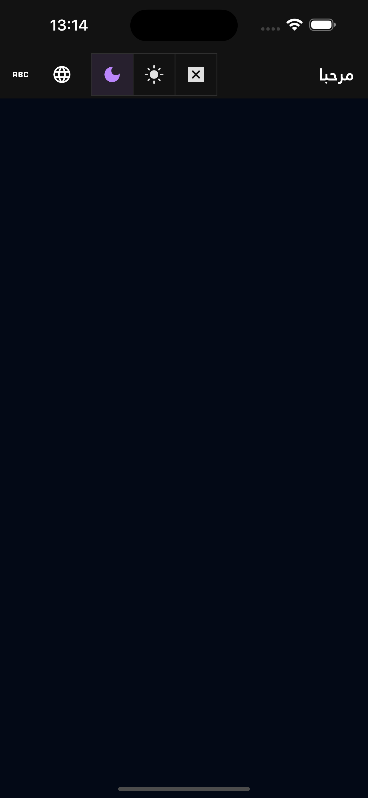
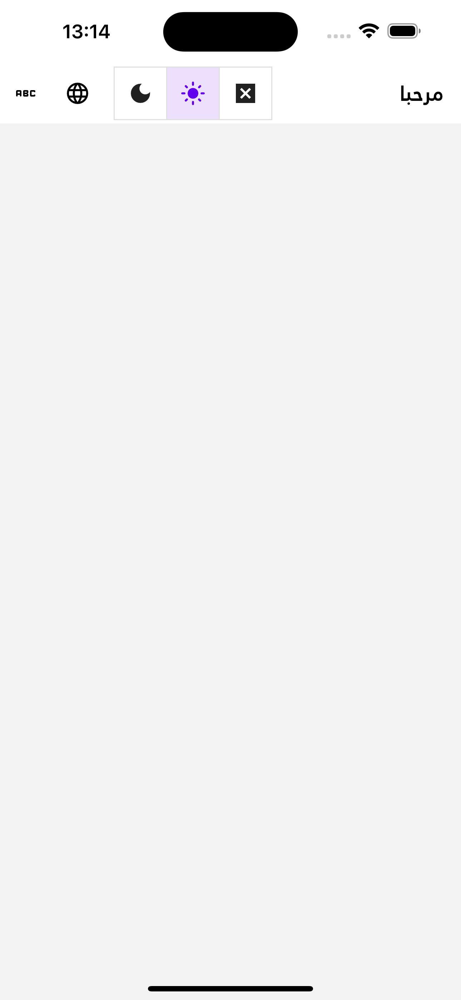
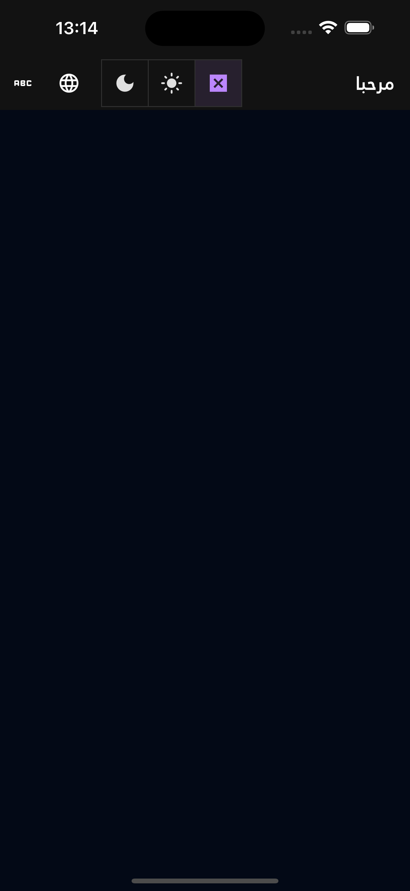

# Flutter Scaffold

This is a Scaffold Application for Flutter projects

### Features

- [database](https://isar.dev/) managemen with [repository.dart](https://github.com/Hamdy/flutter-scaffold/blob/main/lib/repository.dart) and [models.dart](https://github.com/Hamdy/flutter-scaffold/blob/main/lib/models.dart) files
- Locale Support [Arabic (RTL) & English (LTR)]
- Localization and translation files for different languages 
    - Arabic [app_ar.arb](https://github.com/Hamdy/flutter-scaffold/blob/main/lib/l10n/app_ar.arb)
    - English [app_en.arb](https://github.com/Hamdy/flutter-scaffold/blob/main/lib/l10n/app_en.arb)
    - Arabic font `Janna LT` added to assets 
- Custom Theming through [Theme file ](https://github.com/Hamdy/flutter-scaffold/blob/main/lib/theme.dart)
    - [System, Light, Dark] support
    - Theme extensions are supported
- Adaptable Vertical horizontal spacing through [utils.vertical(context, space)](tter-scaffold/blob/main/lib/utils.dart#L14) &  [utils.hotizontal(context, space)](tter-scaffold/blob/main/lib/utils.dart#L10) to adjust spaces based on screen size.
- [State](https://github.com/Hamdy/flutter-scaffold/blob/main/lib/state.dart) Management
- [Logging](https://github.com/Hamdy/flutter-scaffold/blob/main/lib/logger.dart) management

## Init
- Update [debug](https://github.com/Hamdy/flutter-scaffold/blob/main/lib/config.dart#L36) & [defaultLocale](https://github.com/Hamdy/flutter-scaffold/blob/main/lib/config.dart#L37) values in the config file
- Update [designWidth](https://github.com/Hamdy/flutter-scaffold/blob/main/lib/theme.dart#L4) & [designHeight](https://github.com/Hamdy/flutter-scaffold/blob/main/lib/theme.dart#L5) values with appropriate design values in the theme file
- Generate localization files `flutter gen-l10n`
- Build models `flutter pub run build_runner build`
